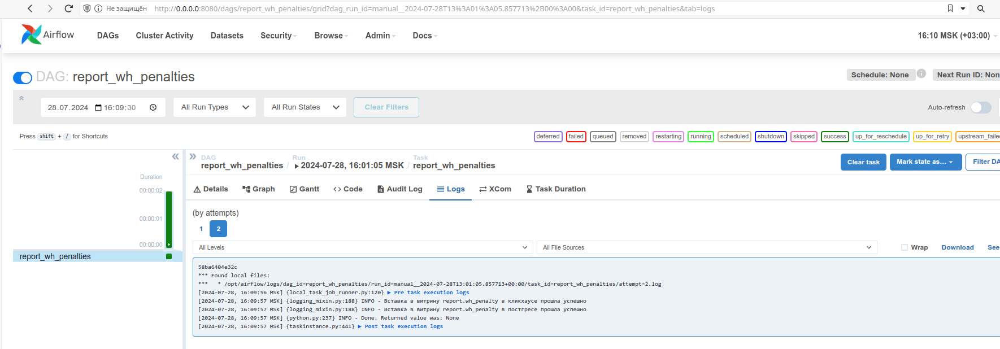
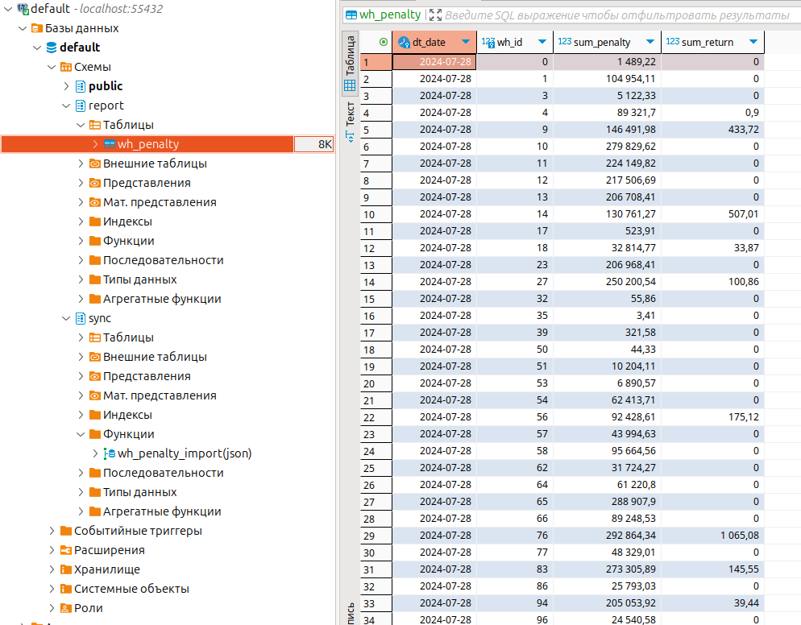

# Работа с Airflow

## 1. Поднимаем контейнеры

Предварительно создадим общую для контейнеров сеть:

```
docker network create airflow_network
```

Затем перейдем в [/airflow](./docker-compose/airflow), [/clickhouse](./docker-compose/clickhouse), [/postgres](./docker-compose/postgres) и везде выполним команду `docker compose up -d`

## 2. Запускаем даг Airflow

После поднятия контейнеров в веб-интерфейсе airflow появится даг report\_wh\_penalties. Код этого дага можно увидеть [здесь](./docker-compose/airflow/dags/wh_penalties.py "wh_penalties.py")

После запуска дага, можно увидеть следующее:



А также в постгресе в витрине появятся данные:


