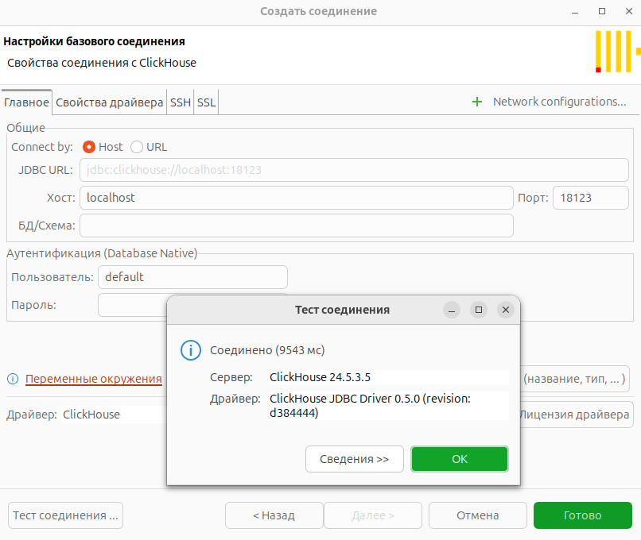

# Работа с Clickhouse

## 1. Поднимаем clickhouse через docker

Соберем образ и пробросим туда измененный [users.xml](./users.xml), чтобы мы могли из-под пользователя default назначить все права новому администратору

```
docker volume create clickhouse_data
docker build -t clickhouse:latest .
docker run -d --name clickhouse -p 18123:8123 -p 19000:9000 -v clickhouse_data:/var/lib/clickouse --ulimit nofile=262144:262144 clickhouse:latest
```

Проверим, что clickhouse поднят и к нему можно подключиться:



## 2. Создаем и настраиваем пользователя-администратора

Выполняем скрипт [task_2.sql](./scripts/task_2.sql)

Подключаемся под clickhouse_admin и проверяем его права:


## 3. Создаем необходимые слои и таблицы

Создаем базы `stg`, `history`, `current` и `direct_log`. В каждом слое создаем таблицу `rating_wh_by_suppliers` - туда будем складывать что-то похожее на оценку блоков поставщиками.

Выполняем скрипт [task_3.sql](./scripts/task_3.sql)

Должна получиться следующая схема:


## 4. Создаём роли и назначаем их по умолчанию новым пользователям

Создаем две роли: readonly и stg_writer. Первая имеет права только на чтение, а вторая - только на создание таблиц в базе stg и вставку данных в таблицы в этом слое

Выполняем скрипт [task_4.sql](./scripts/task_4.sql)

## 5. Заполним stg слой через буферную таблицу

Подготовим окружение:

```
$ cd py_scripts
$ python3 -m venv venv
$ source venv/bin/activate
(venv) $ pip install clickhouse-driver clickhouse-cityhash lz4 numpy pandas
```

> Для Windows 3я команда следующая: `.\venv\Scripts\activate.ps1`

Запустим скрипт, который под пользователем stg_writer заливает данные в буферную таблицу:

```
python3 fill_stg.py
```

Проверим:


