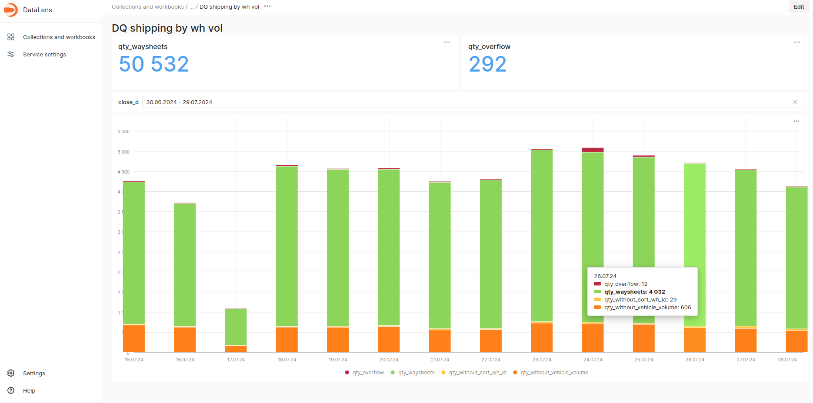

# Работа с Datalens

Запрос на сбор метрик качества данных:

```
create table report.dg_shipping_by_wh_vol_v4 engine MergeTree order by close_d as
select close_d
    , uniq(waysheet_id)                                                      qty_waysheets
    , countIf(sort_wh_id, sort_wh_id = 0)                                    qty_without_sort_wh_id
    , countIf(vehicle_volume, vehicle_volume = 0)                            qty_without_vehicle_volume
    , countIf(shipping_id, sum_vol > vehicle_volume and vehicle_volume != 0) qty_overflow
from report.shipping_by_wh_vol_v4 final
group by close_d
```

Итоговый дашборд:



