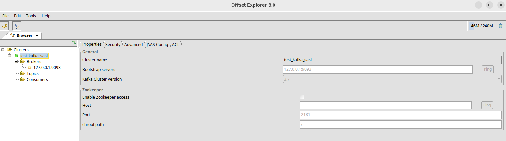
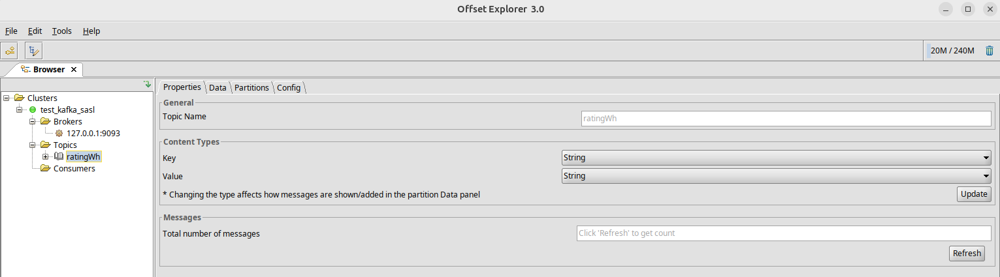
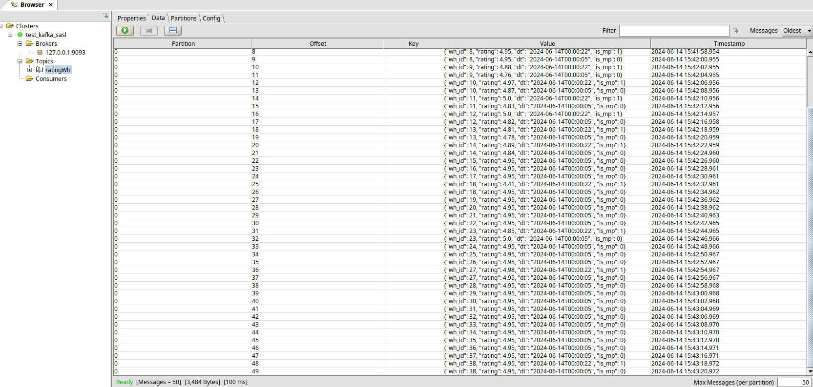

# Работа с kafka

## 1. Поднимаем кафку с sasl

```
$ cd docker_with_sasl/
$ docker compose up -d
...
$ docker compose ps
NAME                IMAGE                          COMMAND                  SERVICE             CREATED             STATUS              PORTS
kafka               confluentinc/cp-kafka:latest   "/etc/confluent/dock…"   kafka               9 seconds ago       Up 8 seconds        0.0.0.0:9092-9093->9092-9093/tcp, :::9092-9093->9092-9093/tcp
zookeeper           zookeeper:latest               "/docker-entrypoint.…"   zookeeper           9 seconds ago       Up 8 seconds        2888/tcp, 3888/tcp, 8080/tcp, 0.0.0.0:1560->2181/tcp, :::1560->2181/tcp
```

Проверяем и подключаемся



## 2. Создаем топик

Сделал через offset explorer



## 3. Заливаем данные из клика в топик kafka

Подготовим окружение (Предварительно находимся в директории **kafka**)

```
$ python3 -m venv venv
$ source venv/bin/activate
(venv) $ pip install -r requirements.txt
```

> Для windows активация venv - `\venv\Scripts\activate.ps1` или `\venv\Scripts\activate.bat`

После этого создаем папку secrets:

```
(venv) $ mkdir secrets
```

И добавляем туда файл `ch_db.json`, указав свои данные для подключения:

```
{
  "server": [
    {
      "host": "url",
      "user": "user",
      "password": "pass",
      "port": 1234
    }
  ]
}
```

Непосредственно сама заливка с помощью [ch_producer.py](./py_scripts/ch_producer.py):

```
(venv) $ cd py_scripts
(venv) $ python3 ch_producer.py
Message delivered to ratingWh [0] at offset 0
Message delivered to ratingWh [0] at offset 1
Message delivered to ratingWh [0] at offset 2
Message delivered to ratingWh [0] at offset 3
...
```

## 4. Просмотр данных в топике




## 5. Чтение из топика python скриптом

Для этого запускаем [ch_consumer.py](./py_scripts/ch_consumer.py):

```
(venv) $ python3 ch_consumer.py
Received message: {"wh_id": 1, "rating": 4.88, "dt": "2024-06-14T00:00:22", "is_mp": 1}
Received message: {"wh_id": 1, "rating": 4.75, "dt": "2024-06-14T00:00:05", "is_mp": 0}
Received message: {"wh_id": 2, "rating": 4.95, "dt": "2024-06-14T00:00:05", "is_mp": 0}
Received message: {"wh_id": 3, "rating": 4.98, "dt": "2024-06-14T00:00:22", "is_mp": 1}
...
```
