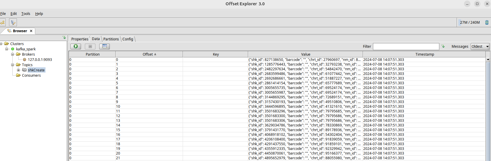
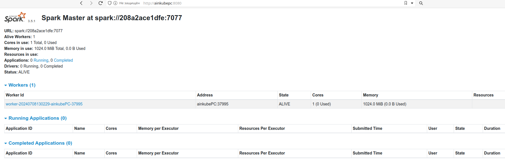
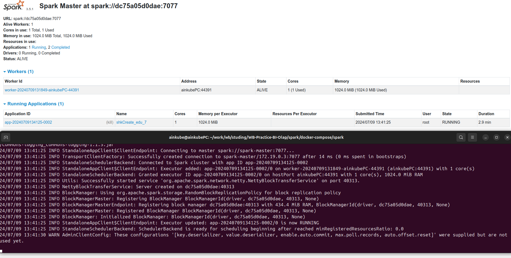

# Работа со Spark

Все решения заданий будут выложены подряд в конце данного файла \
А ниже представлен ход выполнения работы

## 1. Разворачиваем необходимые контейнеры

Перейдем в директорию `docker-compose/spark` и отредактируем файл [.env](./docker-compose/spark/.env), указав вместо **HOSTNAME** имя своей машины (у меня на линуксе команда `hostname` возвращает ainkubePC, поэтому я буду использовать его. А на маке нужно было бы прописать ainkubePC.local).

Теперь выполним команду:

```
docker compose up -d
```

В итоге у нас развернутся следующие контейнеры:
- spark мастер и воркер
- кафка и zookeeper для неё
- clickhouse

При этом в clickhouse уже будут созданы пользователь и необходимые схемы, таблицы, т.к. файл [init.sql](./docker-compose/spark/clickhouse_conf/init.sql) пробрасывается в `/docker-entrypoint-initdb.d` в контейнере и выполняется при первом запуске кликхауса.

## 2. Загружаем данные в кафку

Возвращаемся на две папки назад и переходим в `Streams/`. Там редактируем файл [credentials_example.json](./Streams/credentials_example.json), добавляя в значения ключа `ch` корректное имя хоста, имя пользователя и пароль от боевого клика (оттуда будем брать данные в кафку). Сохраняем и переименовываем отредактированный файл в **credentials.json**.

Подключившись с помощью Offset Explorer к кафке (по адресу `127.0.0.1:9093`) создадим топик `shkCreate`.

Возвращаемся в прошлую директорию и переходим в `kafka-scripts/`. Активируем окружение и устанавливаем необходимые пакеты:

```
$ python3 -m venv venv
$ source venv/bin/activate
(venv) $ pip install -r requirements.txt
```

Запускаем [ch_producer.py](./kafka-scripts/ch_producer.py):

```
python3 ch_producer.py
```

В kafka должны появиться сообщения:



## 3. Донастраиваем clickhouse

В задании необходимо обогатить данные, которые будет читать **spark** новой колонкой. \
Для этого нужно зайти на боевой клик и взять оттуда, например, словарь, экспортировать его в csv и импортировать в таблицу на локальном клике (в данном случае в созданную с помощью [init.sql](./docker-compose/spark/clickhouse_conf/init.sql) таблицу `volume_by_nm`)

## 4. Запускаем Spark application

Проверим, что можем подключиться к spark. Для этого перейдём по адресу http://YOUR_HOSTNAME:8080, где YOUR_HOSTNAME - имя, которое мы указали в [.env](./docker-compose/spark/.env). Если всё правильно, мы увидим следующее:



Затем переходим в контейнер, устанавливаем необходимые пакеты и запускаем [shkCreate_sync_edu.py](./Streams/shkCreate_edu_100/shkCreate_sync_edu.py):

```
docker exec --user root -it spark-master /bin/bash
pip install clickhouse_driver clickhouse_cityhash lz4 pandas
spark-submit --master spark://spark-master:7077  \
    --packages org.apache.spark:spark-sql-kafka-0-10_2.12:3.5.0 \
    --executor-cores 1 \
    --conf spark.driver.extraJavaOptions="-Divy.cache.dir=/tmp -Divy.home=/tmp" \
    /opt/spark/Streams/shkCreate_edu_100/shkCreate_sync_edu.py
```

Как итог, видим, что приложение `shkCreate_edu_7` запущено:



И появились данные в таблице `stage.raw_shkCreate_edu_7`:

[raw_shkCreate_edu_7](./img/raw_shkCreate_edu_7.png)