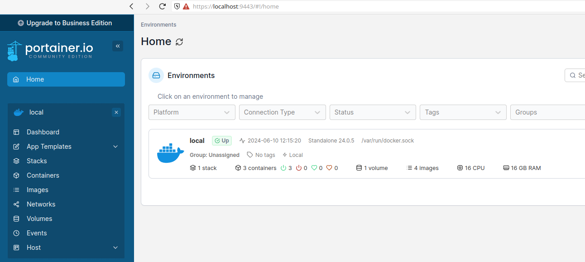
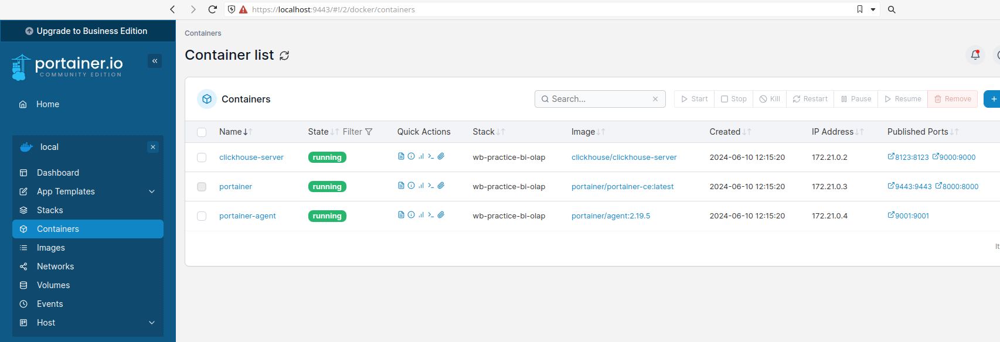

# Задание 3 (развернуть 2 контейнера через docker compose)

Получилось 3 контейнера - `portainer`, `portainer-agent`, `clickhouse-server`

Создаем docker-compose.yaml

```
$ vi docker-compose.yaml

version: "3.3"
services:
  portainer:
    image: portainer/portainer-ce:latest
    container_name: portainer
    ...
    
  portainer_agent:
    image: portainer/agent:2.19.5
    container_name: portainer-agent
    ...
    
  clickhouse-server:
    image: clickhouse/clickhouse-server
    container_name: clickhouse-server
    ...
```

Запускаем

```
$ sudo docker compose up -d
```

В портейнере можно сразу увидеть, что подцепился локальный докер



И посмотреть запущенные контейнеры



Остановим контейнеры

```
$ sudo docker compose down
[+] Running 4/4
 ✔ Container portainer-agent            Removed                                                                                             0.3s 
 ✔ Container clickhouse-server          Removed                                                                                             1.7s 
 ✔ Container portainer                  Removed                                                                                             0.3s 
 ✔ Network wb-practice-bi-olap_default  Removed                                                                                             0.2s
```
